# Summarize and analyze your observability data
Create an interactive dashboard to analyze AI model performance and OpenShift cluster metrics using Prometheus.

## Table of Contents

1. [Detailed description](#detailed-description)
   - [The Challenge](#the-challenge)
   - [Our Solution](#our-solution)
   - [Features](#features)
   - [Current Manual Process](#current-manual-process)
   - [Our Solution Stack](#our-solution-stack)
   - [Architecture diagrams](#architecture-diagrams)
2. [Requirements](#requirements)
   - [Minimum hardware requirements](#minimum-hardware-requirements)
   - [Minimum software requirements](#minimum-software-requirements)
   - [Required user permissions](#required-user-permissions)
3. [Deploy](#deploy)
   - [Quick Start - OpenShift Deployment](#quick-start---openshift-deployment)
   - [Quick Start - Local Development](#quick-start---local-development)
   - [Usage](#usage)
   - [Configuration](#configuration)
     - [Model as a Service (MaaS) Setup](#model-as-a-service-maas-setup)
     - [DEV Mode Workflow](#dev-mode-workflow)
     - [Per-Model API Key Configuration](#per-model-api-key-configuration)
   - [Delete](#delete)
4. [References](#references)
5. [Tags](#tags)

## Detailed description

The OpenShift AI Observability Summarizer turns OpenShift + OpenShift AI observability signals into **plain-English, actionable insights**. Instead of stitching together dashboards and raw metrics, teams can quickly understand performance, cost drivers, and operational risks across AI workloads and the platform that runs them.

### The Challenge

AI platform and SRE teams routinely need to answer questions like:

- “Is my model latency increasing? What changed?”
- “Are GPUs saturated or underutilized?”
- “Which namespace/workload is causing resource pressure?”
- “Do logs/traces correlate with the metric spike?”

Today, these answers often require jumping between tools, writing queries, correlating signals across systems, and then producing a shareable narrative for stakeholders.

### Our Solution

Provide a **metrics-aware AI summarization layer** on top of OpenShift observability:

- Curated + dynamically validated **metrics catalog** (OpenShift + GPU) used for accurate query selection
- Natural-language **Chat with Prometheus** that generates queries and explains results
- **Dashboards** for OpenShift fleet metrics, vLLM metrics, and hardware accelerators
- **Report generation** (HTML/PDF/Markdown) for sharing
- Optional alerting integrations (Slack notifications) when enabled

### Features

- **Console-native experience**: Works where platform teams already operate—inside the OpenShift Console.
- **Faster time-to-answer**: Turn “what changed?” questions into clear, structured summaries in minutes.
- **Fleet + namespace insights**: Move from cluster-wide trends to namespace-level signals without context switching.
- **GPU & model visibility**: Understand accelerator utilization and model-serving performance using the same workflow.
- **Explainable outputs**: Summaries come with supporting details so engineers can validate conclusions quickly.
- **Shareable reporting**: Export clean HTML/PDF/Markdown reports for stakeholders and incident reviews.

### Current Manual Process

Without this project, teams typically:

- Manually browse dashboards and write queries
- Manually identify the “right” metrics among thousands of candidates
- Copy/paste charts and raw values into a document
- Correlate symptoms across:
  - metrics (Prometheus/Thanos)
  - GPU telemetry (DCGM exporter)
  - traces (Tempo)
  - logs (Loki)
- Recreate the same analysis for each incident, model rollout, or performance regression

### Our Solution Stack

**Data sources**

- **Prometheus / Thanos**: OpenShift and workload metrics
- **vLLM**: model-serving metrics (when vLLM is used)
- **DCGM exporter** (optional): GPU metrics (temperature, power, utilization, memory)

**Observability add-ons (optional / stack-managed)**

- **OpenTelemetry Collector**: collects traces and enables auto-instrumentation flows
- **Tempo**: trace storage/query (integrated into OpenShift Console via UI plugin)
- **Loki**: log aggregation/query (integrated into OpenShift Console via UI plugin)
- **MinIO**: object storage backend for traces/logs persistence

**Application components**

- **MCP server**: metrics analysis, report generation, and AI tool-calling surface
- **LLM runtime**:
  - Local model deployment by default (or connect to an existing model via `LLM_URL`)
  - External AI providers: OpenAI, Anthropic, Google, Meta, Model as a Service (MaaS)
- **UI**
  - **OpenShift Console Plugin** (default, `DEV_MODE=false`)
  - **Standalone React UI** (`DEV_MODE=true`)

### Architecture diagrams

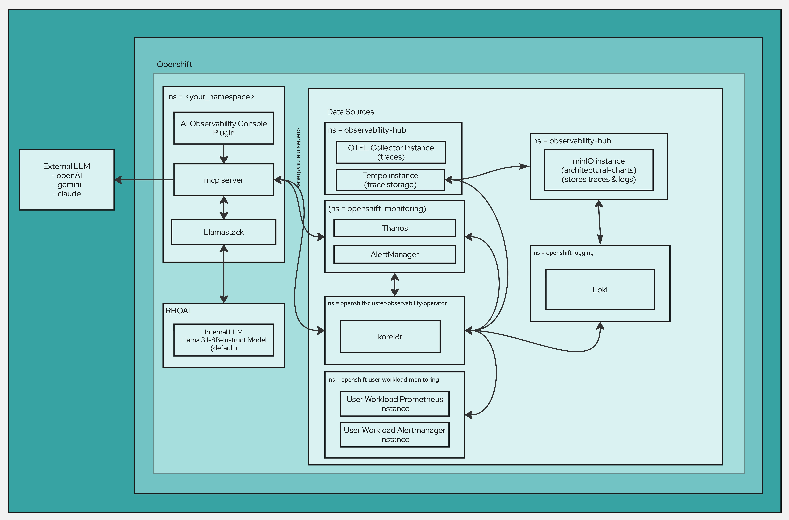

#### Simple flow

1. **Access the AI Observability experience** in OpenShift—either embedded in the OpenShift Console or via the standalone UI.
2. **Choose your analysis context** (cluster, namespace, or model view and a time range), or **ask a question** using the chat interface.
3. The platform **gathers the relevant observability signals** from your environment, covering both the current state and how it has changed over time.
4. It **synthesizes those signals into actionable insights**, highlighting what appears healthy or unhealthy, the most likely contributors, and recommended next checks.
5. **Share outcomes easily** by exporting the findings as a report when needed.

## Requirements

### Minimum hardware requirements

- **CPU**: 4 cores (8 recommended)
- **Memory**: 8 GiB RAM (16 GiB recommended)
- **Storage**: 20 GiB (50 GiB recommended)
- **GPU**: optional (recommended for DCGM + model workloads)

### Minimum software requirements

- **OpenShift**: 4.18.33+
- **OpenShift AI**: 2.16.2+
- **CLI tools**:
  - `oc`
  - `helm` v3.x
  - `yq`
  - `jq` (used by Makefile flows)

### Required user permissions

- **OpenShift**: cluster-admin (or equivalent privileges for installing console plugins, cluster-wide observability components, and required RBAC).

## Deploy

### Option 1: Install via Helm (Recommended)

#### Quick Start - OpenShift Deployment

**Default (production-style): OpenShift Console Plugin UI**

```bash
make install NAMESPACE=your-namespace
```

**Want to install with existing LLMs?**

- **No Hugging Face / no local model download** (use an already-running model endpoint):

```bash
make install NAMESPACE=your-namespace LLM_URL=http://your-llm-endpoint
```

**For developers - Standalone (development/standalone): React UI route**

```bash
make install NAMESPACE=your-namespace DEV_MODE=true
```

**Access**

- **Console Plugin (default)**: OpenShift Console → left navigation → **AI Observability**
- **React UI (DEV_MODE=true)**: OpenShift Console → **Networking → Routes** (route name typically `aiobs-react-ui`)

**Optional console menus**

- Traces menu: `make enable-tracing-ui`
- Logs menu: `make enable-logging-ui`

#### Quick Start - Local Development

Use the local dev helper to port-forward dependencies and run local components.

```bash
uv sync
./scripts/local-dev.sh -n your-namespace
```

#### Usage

#### Enable AI Assistance

Navigate to settings and configure a model:

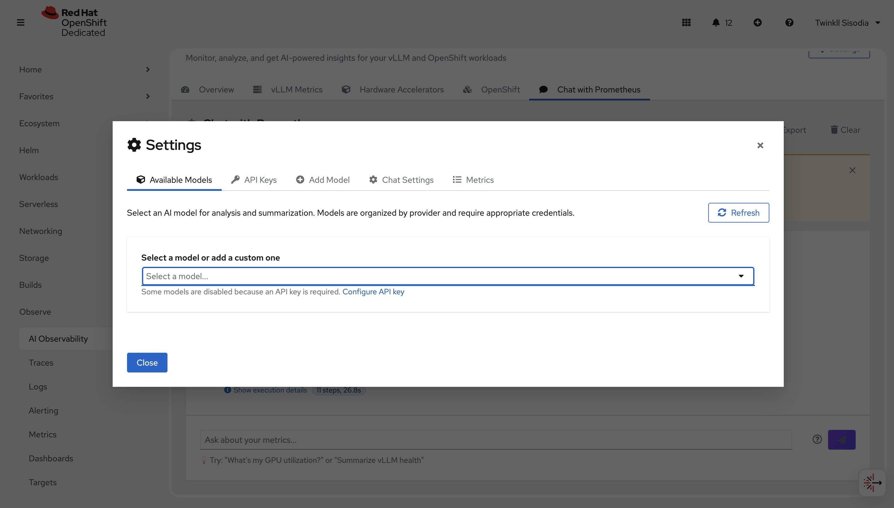

You can either set an `API_KEY` or add a custom model. Supported providers include OpenAI, Gemini, Anthropic, Meta, and Model as a Service (MaaS).

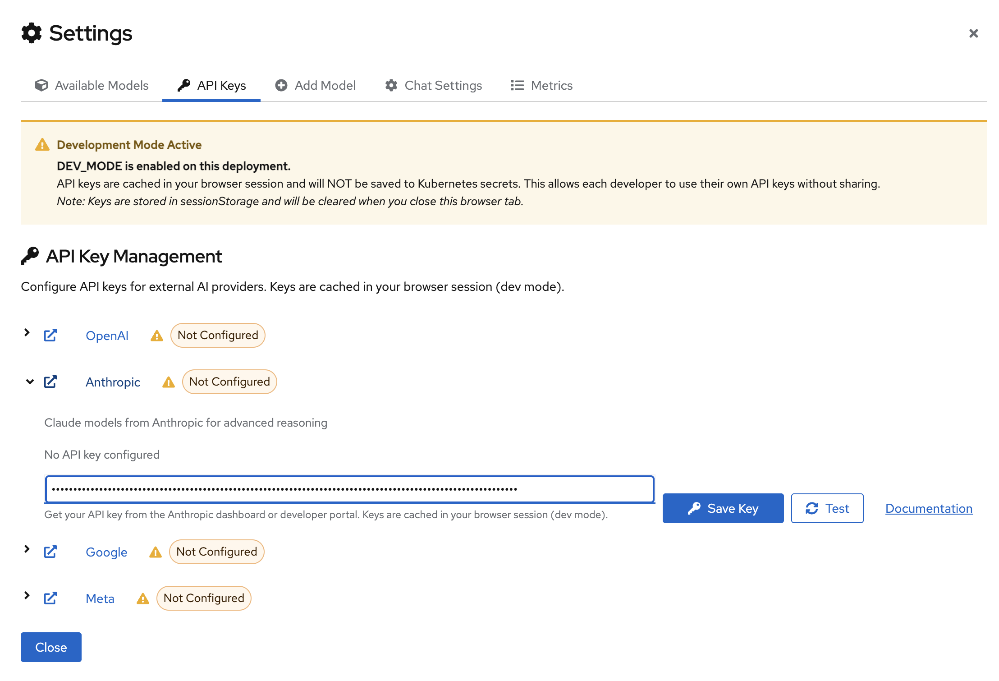

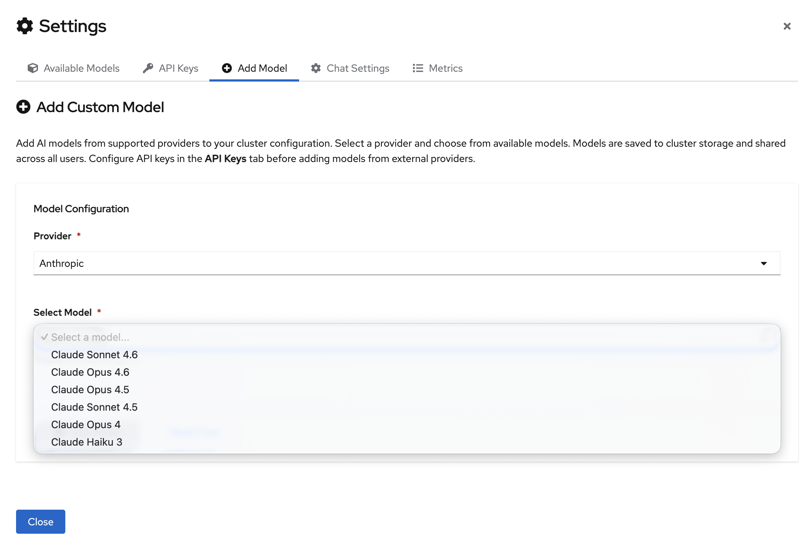

Once the model configuration is set, select your model from the dropdown:

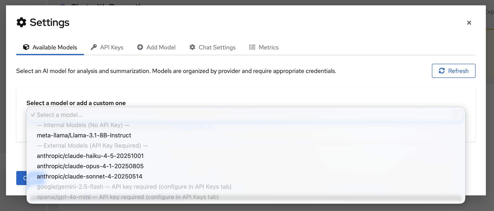

> **For detailed setup instructions**, see the [Configuration](#configuration) section below, which covers MAAS setup, DEV mode workflow, and per-model API key configuration.

#### OpenShift Console Plugin (default)

Open the OpenShift Console and navigate to **AI Observability** from the left navigation.

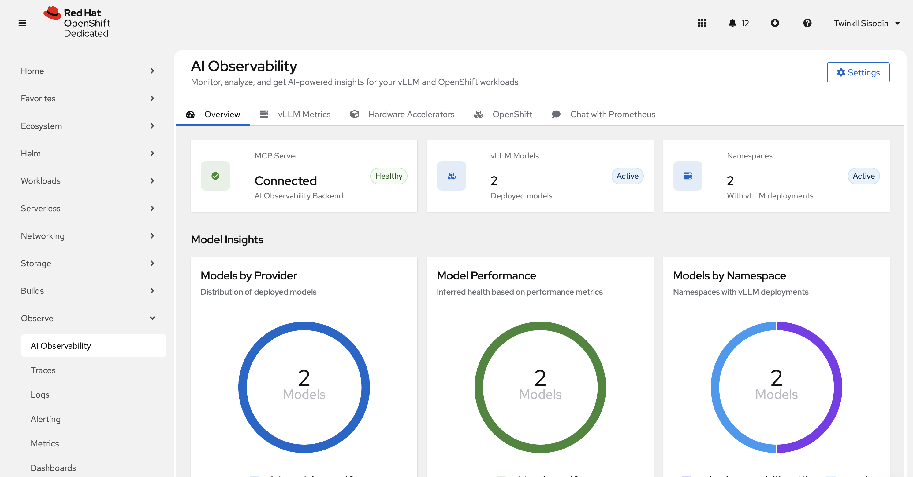

##### vLLM metrics

Use this page to understand model-serving performance when vLLM metrics are present.

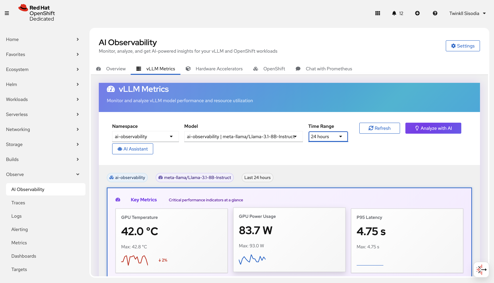

##### Hardware Accelerator

Use this page to review accelerator-related signals (for example GPU utilization/health when available).

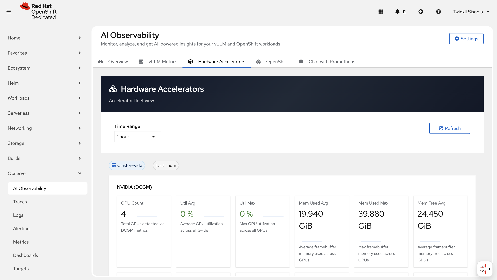

##### OpenShift metrics

Use this page to analyze cluster-wide and namespace-scoped OpenShift metrics.

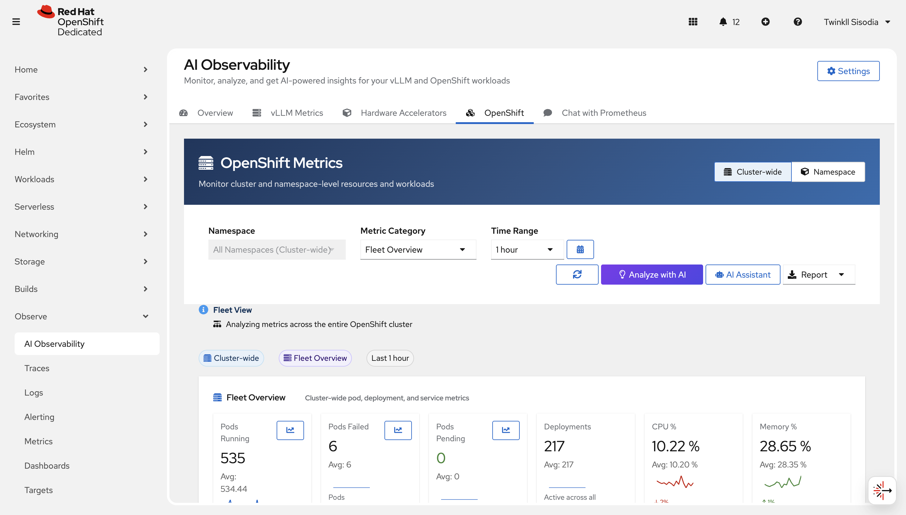

##### Chat with Prometheus

Ask questions in natural language and get a query + explanation back.

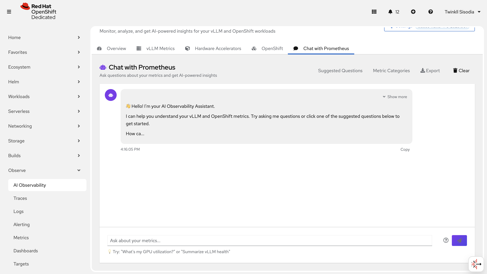

You can also navigate to suggested metrics and choose from the questions there -

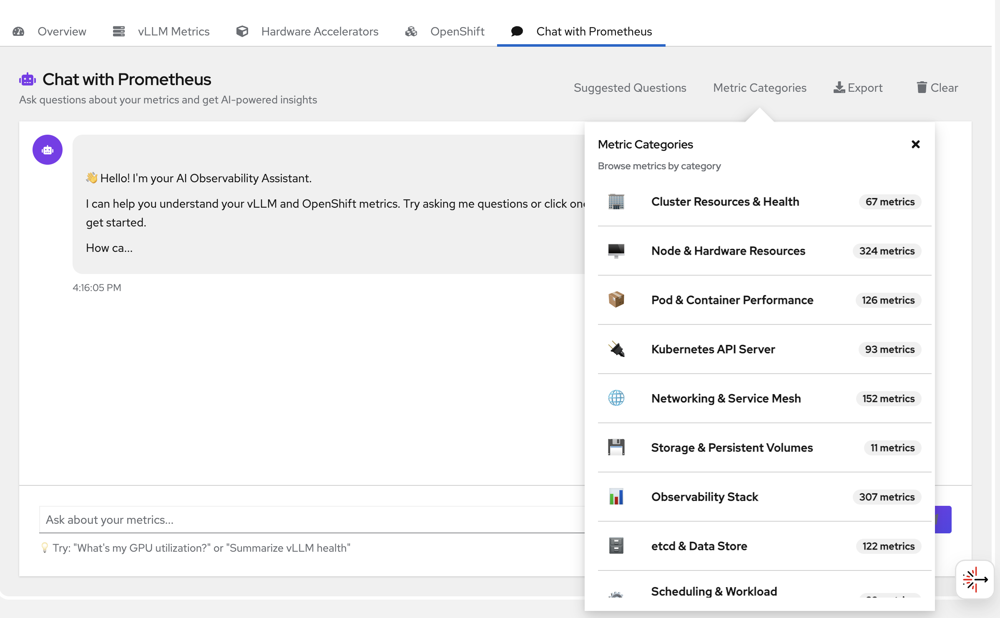

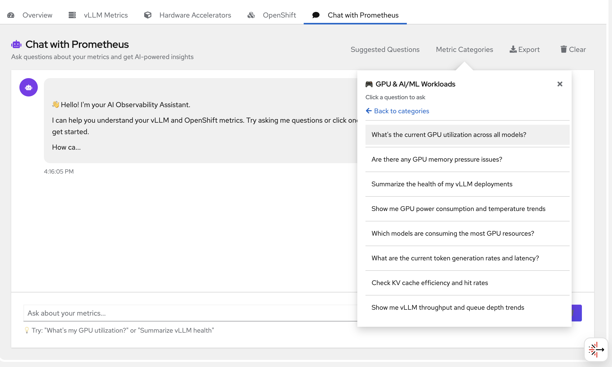

##### Reports

Export reports when needed (HTML/PDF/Markdown).

#### Configuration

#### Model as a Service (MaaS) Setup

Model as a Service provides access to Red Hat-hosted AI models with per-model API key configuration.

**Adding a MAAS Model:**

1. Navigate to **AI Observability → Settings → Add Model**
2. Select **Model as a Service (MaaS)** as the provider
3. Choose a model from the dropdown or enter a custom model ID
4. Provide your MAAS API key (unique per model)
5. (Optional) Override the default endpoint URL if needed
6. Click **Add Model**

**Key Features:**

- **Per-model API keys**: Each MAAS model requires its own API key, unlike other providers that use global keys
- **Custom endpoints**: Supports custom MAAS deployments for dev/staging/production environments
- **No global credentials**: MAAS models are configured individually in the "Add Model" tab, not in "API Keys"

**Environment Configuration:**

For production deployments with custom MAAS endpoints, set the environment variable in Helm values:

```yaml
env:
  MAAS_API_URL: "https://your-custom-maas.example.com/v1"
```

#### DEV Mode Workflow

DEV mode allows developers to test external AI models using browser sessionStorage instead of Kubernetes Secrets and ConfigMaps. This is ideal for:

- Local development without cluster permissions
- Testing different models quickly
- Avoiding secrets management overhead

**Enabling DEV Mode:**

```bash
make install NAMESPACE=your-namespace DEV_MODE=true
```

**How it works:**

- **API keys** are cached in browser `sessionStorage` (cleared on tab close)
- **Model configurations** are saved to browser `sessionStorage` (no ConfigMap updates)
- **Production mode** continues using Kubernetes Secrets/ConfigMaps for persistent storage

**DEV Mode Workflow:**

1. Install with `DEV_MODE=true`
2. Open the React UI (check Routes for `aiobs-react-ui`)
3. Navigate to **Settings → API Keys** or **Settings → Add Model**
4. Configure your models and API keys (saved to browser only)
5. Test your models immediately—no cluster resources modified

**Clearing DEV Mode Cache:**

A "Clear Cache" button is available in DEV mode to remove all cached credentials and model configurations from the browser.

**Production vs. DEV Mode:**

| Feature | Production (`DEV_MODE=false`) | DEV Mode (`DEV_MODE=true`) |
|---------|------------------------------|---------------------------|
| API Keys | Kubernetes Secrets | Browser sessionStorage |
| Model Configs | ConfigMap | Browser sessionStorage |
| Persistence | Permanent (cluster-wide) | Session only (tab close = reset) |
| Permissions | Requires RBAC | No cluster permissions needed |
| UI | Console Plugin | Standalone React UI |

#### Per-Model API Key Configuration

Different providers handle API keys differently:

**Global Provider Keys** (API Keys Tab)

Most providers use a single API key for all models:

- **OpenAI**: One key for all GPT models
- **Anthropic**: One key for all Claude models
- **Google**: One key for all Gemini models
- **Meta**: One key for all Llama models

Configure these in **Settings → API Keys**.

**Per-Model Keys** (Add Model Tab)

MAAS uses unique API keys per model:

- **Model as a Service (MaaS)**: Each model requires its own API key and endpoint

Configure these in **Settings → Add Model**.

**Custom Models:**

For custom OpenAI-compatible endpoints:

1. Go to **Settings → Add Model**
2. Select your provider (e.g., OpenAI, Meta, or Other)
3. Enter the model ID
4. Provide the custom endpoint URL
5. Enter the API key
6. Click **Add Model**

The system will inject the custom `api_url` when calling the model, enabling support for:

- Self-hosted models
- Custom model deployments
- Alternative OpenAI-compatible APIs

#### Observe → Traces / Observe → Logs (optional)

If enabled in your cluster, use:

- **Observe → Traces** to view traces
- **Observe → Logs** to query logs

---

### Option 2: Install via Operator (Optional)

For production environments requiring OLM-managed lifecycle and automatic dependency management, an operator-based installation is available.

**When to use the Operator:**
- Production deployments requiring centralized operator management
- Environments where OLM manages all infrastructure components
- Need for automatic dependency operator installation (Loki, Tempo, OTEL, etc.)
- Cluster-wide singleton deployment pattern required

**Quick Install:**
1. **Install CatalogSource:** `oc apply -f deploy/operator/catalog-source.yaml`
2. **Install Operator:** OperatorHub → Search "AI Observability" → Install
3. **Create CR:** Configure and create AIObservabilitySummarizer custom resource

**What the Operator Provides:**
- **Automatic dependency management**: OLM installs Cluster Observability, OpenTelemetry, Tempo, Logging, and Loki operators
- **Multi-namespace deployment**: Components automatically deployed to appropriate namespaces (ai-observability, observability-hub, openshift-logging, etc.)
- **Cluster auto-configuration**: User Workload Monitoring, Alertmanager, and Console Plugin registration
- **Lifecycle management**: OLM handles upgrades, dependencies, and version compatibility

**📚 Full Documentation:**
- **User Guide:** [docs/OPERATOR.md](docs/OPERATOR.md) - Complete installation, configuration, and troubleshooting
- **Technical Reference:** [deploy/operator/README.md](deploy/operator/README.md) - Architecture, development, building operator images

**Development:**
```bash
make operator-config  # Show current operator configuration
make operator-deploy  # Build and push all operator images
```

> **Note:** The operator and Helm installation methods are mutually exclusive. Choose one approach for your cluster.

---

## Delete

Uninstall the deployment from the namespace:

```bash
make uninstall NAMESPACE=your-namespace
```

## References

- Uses [Prometheus](https://prometheus.io/) and [Thanos](https://thanos.io/)
- Uses [Tempo](https://grafana.com/oss/tempo/) for traces
- Uses [Loki](https://grafana.com/oss/loki/) for logs
- Uses [vLLM](https://github.com/vllm-project/vllm) for model serving (when applicable)
- Integrates with [OpenTelemetry](https://opentelemetry.io/) for distributed tracing and observability

## Tags

- **Business challenge:** Adopt and scale AI
- **Product:** OpenShift AI
- **Use case:** AI Operations, Observability, Monitoring
