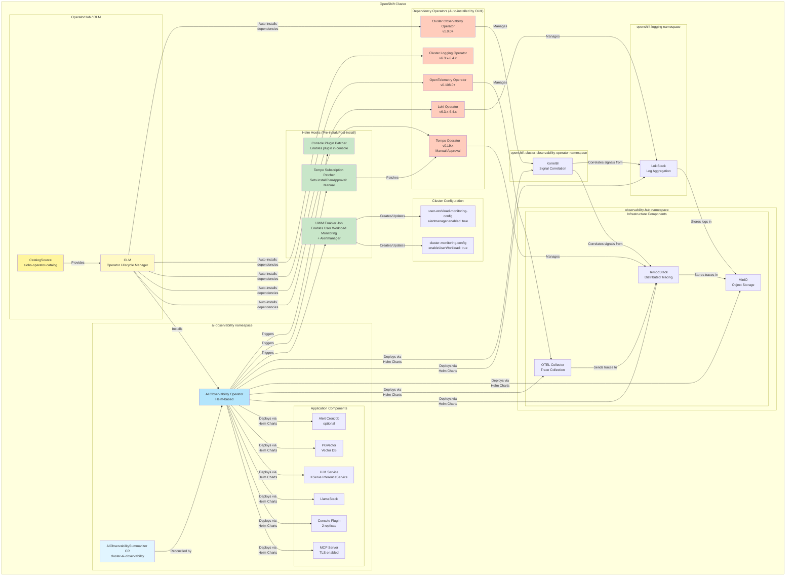

# AI Observability Summarizer Operator

A Helm-based Kubernetes Operator for deploying the AI Observability Summarizer stack on OpenShift with full OLM (Operator Lifecycle Manager) support.

## Overview

This operator provides a single Custom Resource (`AIObservabilitySummarizer`) to deploy the complete AI-powered observability stack. Built with `operator-sdk` using the Helm operator pattern, it wraps existing Helm charts without custom Go code.

### Components Deployed

**Always Installed:**
- **MCP Server**: Model Context Protocol server for AI-driven observability queries (with TLS)
- **OpenShift Console Plugin**: Native integration with OpenShift Console

**RAG Stack (When Enabled):**
- **LLM Service**: KServe InferenceService with vLLM for local model deployment
- **LlamaStack**: LLM orchestration layer
- **PGVector**: Vector database for RAG

**Optional Features:**
- **RAG Stack**: LLM deployment with LlamaStack, vLLM, and PGVector - *enabled by default, can be disabled*
- **Alerting**: Automated alert analysis and summarization (CronJob, Slack webhook optional) - *disabled by default*
- **Development Mode**: Enables browser-cached API keys for testing - *disabled by default*

**Infrastructure (Always Installed):**
- **MinIO**: Object storage for Tempo/Loki
- **TempoStack**: Distributed tracing backend
- **OTEL Collector**: OpenTelemetry trace collection
- **LokiStack**: Log aggregation
- **Korrel8r**: Signal correlation engine

## Architecture

The AI Observability Summarizer Operator follows a **Helm-based operator pattern** with OLM dependency management and automated cluster configuration.

### Architecture Diagram



### Key Features

1. **OLM Dependency Management**
   - Operator declares dependencies in `bundle/metadata/dependencies.yaml`
   - OLM automatically installs required operators with version constraints
   - Tempo operator pinned to v0.16.0-2 and set to Manual approval to prevent buggy upgrades

2. **Multi-Namespace Deployment**
   - **ai-observability**: Application components (MCP Server, Console Plugin, RAG stack)
   - **observability-hub**: Infrastructure (Tempo, OTEL, MinIO)
   - **openshift-logging**: LokiStack deployment
   - **openshift-cluster-observability-operator**: Korrel8r deployment

3. **Automated Cluster Configuration**
   - **UWM Enabler Hook**: Enables User Workload Monitoring and Alertmanager (pre-install)
   - **Tempo Subscription Patcher**: Sets Tempo operator to Manual approval (post-install)
   - **Console Plugin Patcher**: Enables plugin in OpenShift Console (post-install)

4. **Helm-Based Operator Pattern**
   - No custom Go code - pure Helm chart wrapper
   - Built with operator-sdk v1.37.0
   - Reconciles CR changes by re-rendering Helm charts
   - All configurations in Helm values

5. **Singleton Pattern**
   - Only one AIObservabilitySummarizer CR allowed per cluster
   - Infrastructure components shared across namespaces
   - Validated at operator level

### Deployment Flow

When you create an `AIObservabilitySummarizer` CR, the following happens automatically:

```
1. OLM installs dependency operators (if not already installed)
   ├── Cluster Observability Operator
   ├── OpenTelemetry Operator
   ├── Tempo Operator (with Manual approval)
   ├── Cluster Logging Operator
   └── Loki Operator

2. Pre-install Helm Hooks execute (hook-weight: -15 to -20)
   └── uwm-enabler job
       ├── Enables User Workload Monitoring
       └── Enables Alertmanager for UWM

3. Operator renders and applies Helm charts
   ├── Infrastructure charts (to multiple namespaces)
   │   ├── TempoStack → observability-hub
   │   ├── LokiStack → openshift-logging
   │   ├── OTEL Collector → observability-hub
   │   ├── MinIO → observability-hub
   │   └── Korrel8r → openshift-cluster-observability-operator
   └── Application charts (to ai-observability)
       ├── MCP Server
       ├── Console Plugin
       ├── LlamaStack (if RAG enabled)
       ├── LLM Service (if RAG enabled)
       ├── PGVector (if RAG enabled)
       └── Alert CronJob (if alerting enabled)

4. Post-install Helm Hooks execute (hook-weight: 5-10)
   ├── tempo-subscription-patcher job
   │   └── Sets Tempo operator to Manual approval
   └── console-plugin-patcher job
       └── Enables plugin in OpenShift Console

5. Operator enters reconciliation loop
   └── Watches CR for changes and re-renders charts
```

### Helm Hook Jobs

All hook jobs are configured with:
- `hook-delete-policy: before-hook-creation,hook-succeeded` (auto-cleanup)
- Dedicated ServiceAccounts with minimal RBAC
- Idempotent scripts (safe to run multiple times)

| Job | Hook Type | Weight | Purpose | Namespace |
|-----|-----------|--------|---------|-----------|
| **uwm-enabler** | pre-install, pre-upgrade | -15 | Enable UWM + Alertmanager | ai-observability |
| **tempo-subscription-patcher** | post-install, post-upgrade | 5 | Set Tempo to Manual approval | ai-observability |
| **console-plugin-patcher** | post-install, post-upgrade | 10 | Enable Console Plugin | ai-observability |

### Component Deployment Map

| Component | Type | Namespace | Managed By | Purpose |
|-----------|------|-----------|------------|---------|
| **MCP Server** | Deployment | ai-observability | Helm Chart | Model Context Protocol server with TLS |
| **Console Plugin** | Deployment (2 replicas) | ai-observability | Helm Chart | OpenShift Console integration |
| **LlamaStack** | Deployment | ai-observability | Helm Chart | LLM orchestration layer |
| **LLM Service** | InferenceService | ai-observability | Helm Chart (via KServe) | vLLM model serving |
| **PGVector** | StatefulSet | ai-observability | Helm Chart | Vector database for RAG |
| **Alert CronJob** | CronJob | ai-observability | Helm Chart | Alert analysis (optional) |
| **TempoStack** | TempoStack CR | observability-hub | Tempo Operator | Distributed tracing backend |
| **LokiStack** | LokiStack CR | openshift-logging | Loki Operator | Log aggregation |
| **OTEL Collector** | OpenTelemetryCollector CR | observability-hub | OpenTelemetry Operator | Trace collection |
| **MinIO** | StatefulSet | observability-hub | Helm Chart | S3-compatible object storage |
| **Korrel8r** | Deployment | openshift-cluster-observability-operator | Helm Chart | Signal correlation engine |

## Prerequisites

- OpenShift 4.12+
- Cluster admin access
- GPU node (optional, only if RAG Stack is enabled)
- HuggingFace API token (optional, only if RAG Stack is enabled): https://huggingface.co/settings/tokens

### Automatic Cluster Configuration

The operator automatically configures the following cluster-level settings via Helm pre-install/post-install hooks:

1. **User Workload Monitoring** (via `uwm-enabler` job)
   - Enables `enableUserWorkload: true` in `cluster-monitoring-config` ConfigMap
   - Enables Alertmanager for User Workload Monitoring in `user-workload-monitoring-config` ConfigMap:
     - `alertmanager.enabled: true`
     - `alertmanager.enableAlertmanagerConfig: true`
   - Required for PrometheusRules, ServiceMonitors, and alerting
   - Idempotent - checks if already enabled before applying

2. **Tempo Operator Protection** (via `tempo-subscription-patcher` job)
   - Sets Tempo operator `installPlanApproval: Manual`
   - Prevents automatic upgrades to buggy versions (v0.18.0+)
   - Requires manual approval for Tempo operator upgrades

3. **Console Plugin Registration** (via `console-plugin-patcher` job)
   - Registers AI Observability plugin with OpenShift Console
   - Enables native console integration

### Required Operators (Auto-Installed by OLM)

These operators are declared as OLM dependencies and will be **automatically installed** when this operator is installed:

| Operator | Package Name | Version Constraint | Required API | Notes |
|----------|--------------|-------------------|--------------|-------|
| **Cluster Observability Operator** | `cluster-observability-operator` | `>=1.0.0 <2.0.0` | `UIPlugin`, `Korrel8r` | Signal correlation |
| **OpenTelemetry Operator** | `opentelemetry-product` | `>=0.108.0 <1.0.0` | `OpenTelemetryCollector` | Trace collection |
| **Tempo Operator** | `tempo-product` | `>=0.16.0-2 <0.17.0` | `TempoStack` | **Pinned to v0.16.x*** |
| **Cluster Logging Operator** | `cluster-logging` | `>=6.3.0 <6.5.0` | `ClusterLogForwarder` | Log forwarding |
| **Loki Operator** | `loki-operator` | `>=6.3.0 <6.5.0` | `LokiStack` | Log storage |

> **\*Tempo Operator Security:** The operator automatically sets Tempo's `installPlanApproval: Manual` to prevent automatic upgrades to buggy versions (v0.18.0+ has container crash issues - [APPENG-3916](https://issues.redhat.com/browse/APPENG-3916)). Tempo operator upgrades will require manual approval via the OpenShift Console or CLI.

> **Note:** OpenShift AI (RHOAI) for KServe/InferenceService is NOT auto-installed and must be installed separately if using RAG with local LLM deployment.

## Installation

### Step 1: Install Catalog Source

**Option A - Via CLI:**
```bash
oc apply -f deploy/operator/catalog-source.yaml

# Wait for catalog to be ready
oc get catalogsource aiobs-operator-catalog -n openshift-marketplace -w
```

**Option B - Via OpenShift Console:**
- Click **+** (Import YAML) in the top navigation bar

  

- Paste the contents of `deploy/operator/catalog-source.yaml`
- Click **Create**

  

### Step 2: Install Operator via OpenShift Console

1. Open **OpenShift Console**
2. Navigate to **Operators → OperatorHub**
3. Search for **"AI Observability"**
4. Click **Install**
5. Configure installation:
   - **Update channel:** alpha
   - **Installation mode:** A specific namespace on the cluster
   - **Installed Namespace:** Select or create **ai-observability** (namespace will be created automatically if it doesn't exist)
   - **Update approval:** Automatic
6. Click **Install**

> **Note:** OLM will automatically create the `ai-observability` namespace during installation if it doesn't exist.

### Step 3: Create AIObservabilitySummarizer

1. Navigate to **Operators → Installed Operators → AI Observability Summarizer**
2. Click **Create AIObservabilitySummarizer**
3. Fill in the form:
   - **Enable RAG Stack** (Optional): Enabled by default, disable if you don't need LLM deployment
   - **HuggingFace Token** (required if RAG enabled): Your HF token for model download from https://huggingface.co/settings/tokens
   - **Device Type**: `gpu` (recommended), `hpu`, `gpu-amd`, or `cpu`
   - **Model Selection**: Choose ONE LLM model:
     - **Llama 3.1 8B Instruct** (Recommended) - Default, enabled
     - Llama 3.2 1B/3B Instruct - For limited GPU memory
     - Llama 3.3 70B Instruct - For maximum quality (4 GPUs required)
     - Llama Guard models - For content moderation/safety
   - **Enable Alert Analysis** (Optional): Toggle for automated alert summarization via CronJob (Slack webhook optional)
   - **Development Mode** (Advanced): Enable browser-cached API keys for testing (DO NOT use in production)
4. Click **Create**

> **Note**: Infrastructure components (Tempo, Loki, OTEL, MinIO, Korrel8r) are **always deployed** automatically to fixed namespaces. You only configure application components (RAG, Alerting, Dev Mode) and LLM settings.

## Uninstallation

### Via OpenShift Console

1. **Delete the CR:**
   - Go to **Operators → Installed Operators → AI Observability Summarizer**
   - Click on **AIObservabilitySummarizer** tab
   - Delete the CR instance

2. **Uninstall the Operator:**
   - Go to **Operators → Installed Operators**
   - Find **AI Observability Summarizer**
   - Click **⋮ → Uninstall Operator**

3. **Uninstall Dependency Operators (Optional):**
   - The following operators were auto-installed by OLM and can be uninstalled if no longer needed:
     - Cluster Observability Operator
     - OpenTelemetry Operator
     - Tempo Operator
     - Cluster Logging Operator
     - Loki Operator
   - Go to **Operators → Installed Operators**
   - For each operator: Click **⋮ → Uninstall Operator**

4. **Delete the Catalog Source:**
   - Go to **Administration → CustomResourceDefinitions**
   - Search for **CatalogSource**
   - Find `aiobs-operator-catalog` in `openshift-marketplace`
   - Delete it

Or via CLI:
```bash
# Delete CR
oc delete aiobservabilitysummarizer --all -n ai-observability

# Delete operator subscription and CSV
oc delete subscription aiobs-operator -n ai-observability
oc delete csv -l operators.coreos.com/aiobs-operator.ai-observability -n ai-observability

# Uninstall dependency operators (optional - if no longer needed)
# List all installed operators to find dependency operators
oc get csv -n ai-observability

# Delete each dependency operator (example for Tempo)
oc delete subscription tempo-operator -n ai-observability
oc delete csv tempo-operator.v0.16.0 -n ai-observability

# Repeat for: cluster-observability-operator, opentelemetry-operator,
# cluster-logging, loki-operator

# Delete catalog source
oc delete catalogsource aiobs-operator-catalog -n openshift-marketplace
```

## Configuration Reference

### Application Components

| Field | Path | Default | Description |
|-------|------|---------|-------------|
| **MCP Server** | `mcpServer.enabled` | `true` | Model Context Protocol server (always enabled) |
| **Console Plugin** | `consolePlugin.enabled` | `true` | OpenShift Console integration (always enabled) |
| **RAG Stack** | `rag.enabled` | `true` | LLM stack deployment (enabled by default, can be disabled) |
| **Alert Analysis** | `alerting.enabled` | `false` | CronJob for alert summarization (Slack webhook optional) |
| **Development Mode** | `global.devMode` | `false` | Browser-cached API keys (testing only) |

> **Note:** All infrastructure components automatically use the cluster's default StorageClass for persistent volumes. Advanced users can customize storage settings in Helm values.

### RAG/LLM Configuration

| Field | Path | Default | Description |
|-------|------|---------|-------------|
| **HuggingFace Token** | `rag.llm-service.secret.hf_token` | *required if RAG enabled* | Token for model download from HuggingFace |
| **Device Type** | `rag.llm-service.device` | `gpu` | Hardware accelerator: `gpu`, `hpu`, `gpu-amd`, or `cpu` |
| **Llama 3.1 8B** | `rag.global.models.llama-3-1-8b-instruct.enabled` | `true` | **Recommended** - 16GB VRAM required |
| **Llama 3.2 1B** | `rag.global.models.llama-3-2-1b-instruct.enabled` | `false` | Smallest model - 2GB VRAM |
| **Llama 3.2 3B** | `rag.global.models.llama-3-2-3b-instruct.enabled` | `false` | Small model - 6GB VRAM |
| **Llama 3.3 70B** | `rag.global.models.llama-3-3-70b-instruct.enabled` | `false` | Largest model - 4 GPUs (140GB+ VRAM) |
| **Llama 3.2 1B Quantized** | `rag.global.models.llama-3-2-1b-instruct-quantized.enabled` | `false` | Quantized w8a8 for lower memory |
| **Llama Guard 3 1B** | `rag.global.models.llama-guard-3-1b.enabled` | `false` | Safety model - 2GB VRAM |
| **Llama Guard 3 8B** | `rag.global.models.llama-guard-3-8b.enabled` | `false` | Safety model - 16GB VRAM |

### Infrastructure Components (Always Installed)

The following infrastructure components are **always deployed** to fixed namespaces and cannot be disabled:

- **TempoStack**: Distributed tracing backend (deployed to `observability-hub`)
- **LokiStack**: Log aggregation (deployed to `openshift-logging`)
- **OTEL Collector**: OpenTelemetry trace collection (deployed to `observability-hub`)
- **MinIO**: Object storage for Tempo/Loki (deployed to `observability-hub`)
- **Korrel8r**: Signal correlation engine (deployed to `openshift-cluster-observability-operator`)

> **Note**: Only **one AIObservabilitySummarizer CR** is allowed per cluster (singleton pattern enforced by the operator). All infrastructure components are shared cluster-wide.

## Development

### Building Operator Images

Use the root Makefile for consistent builds:

```bash
# Show current configuration
make operator-config

# Build and push all images (in correct order)
make operator-build operator-push \
     operator-bundle-build operator-bundle-push \
     operator-catalog-build operator-catalog-push

# Or with custom version/registry
make operator-build operator-push VERSION=1.0.8 ORG=myorg
```

### Project Structure

```
deploy/operator/
├── Dockerfile              # Operator image
├── Makefile                # Build targets
├── PROJECT                 # Operator SDK project config
├── watches.yaml            # Helm chart to CR mapping
├── catalog-source.yaml     # CatalogSource for OLM installation
├── config/
│   ├── crd/                # Custom Resource Definition
│   ├── manager/            # Operator deployment
│   ├── rbac/               # RBAC permissions
│   ├── samples/            # Example CRs
│   └── manifests/          # OLM manifests base
└── bundle/                 # OLM bundle for OperatorHub
    ├── manifests/          # CSV, CRD
    ├── metadata/           # Annotations
    └── tests/              # Scorecard tests
```

### Run Locally (Development)

```bash
cd deploy/operator
make install   # Install CRDs
make run       # Run operator locally
```

## Troubleshooting

### Operator OOMKilled
The operator requires 2Gi memory. Check `config/manager/manager.yaml` for resource limits.

### Namespaces Already Exist
The operator creates required namespaces (`observability-hub`, `openshift-cluster-observability-operator`) automatically. Kubernetes handles idempotent namespace creation - if they already exist, no error occurs. If you see ownership conflicts, another operator may be managing the same namespace.

### LLM Model Not Loading
Ensure HuggingFace token is valid and has access to the model:
```bash
oc logs -n ai-observability deployment/llama-3-1-8b-instruct-predictor
```

### Console Plugin Not Showing
Check if plugin is enabled:
```bash
oc get consoleplugin openshift-ai-observability
oc get console.operator.openshift.io cluster -o jsonpath='{.spec.plugins}'
```

### Check Operator Logs
```bash
oc logs -n ai-observability -l control-plane=controller-manager -f
```

## Validation Rules

The operator enforces these rules:
1. **Namespace**: CR must be created in `ai-observability` namespace
2. **Singleton**: Only one CR allowed per cluster
3. **HuggingFace Token**: Required when RAG is enabled

## License

Apache License 2.0
