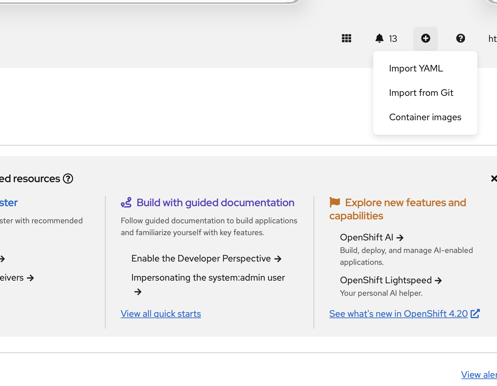
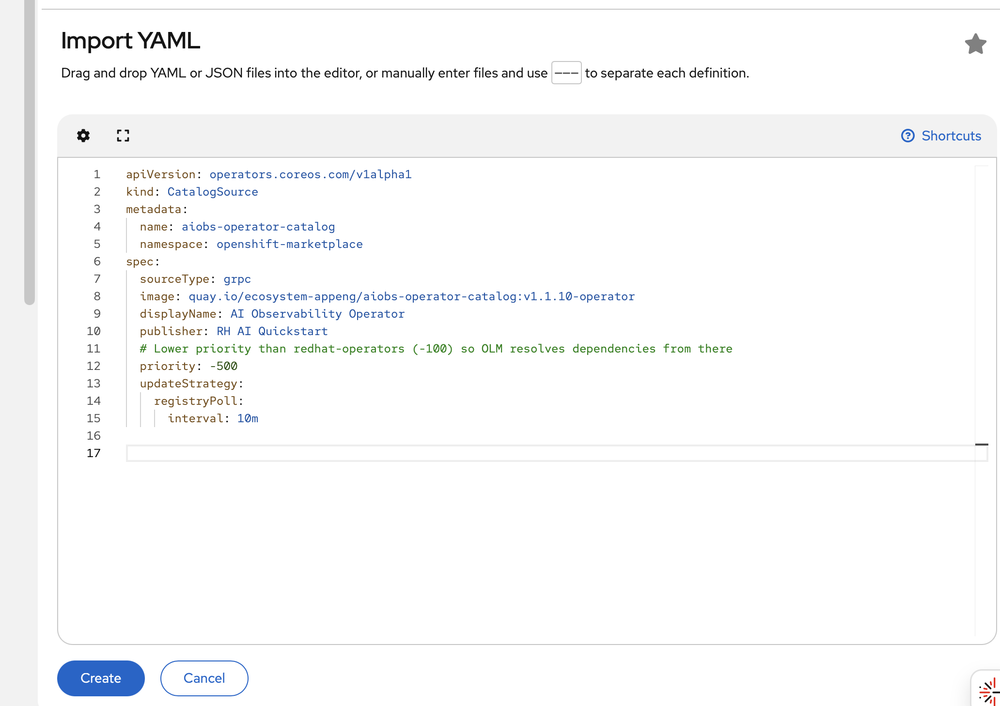

# AI Observability Summarizer Operator

A Helm-based Kubernetes Operator for deploying the complete AI Observability stack on OpenShift with one-click installation via OperatorHub.

## Quick Start

### Prerequisites

- OpenShift 4.18+
- Cluster admin access
- GPU node (optional, only if RAG Stack is enabled)
- HuggingFace API token (optional, only if RAG Stack is enabled): https://huggingface.co/settings/tokens

### Installation (3 Steps)

**1. Install CatalogSource**

Option A - Via CLI:
```bash
oc apply -f deploy/operator/catalog-source.yaml
```

Option B - Via OpenShift Console:
- Click **+** (Import YAML) in the top navigation bar

  

- Paste the contents of `deploy/operator/catalog-source.yaml`
- Click **Create**

  

**2. Install Operator via OpenShift Console**
- Navigate to **Operators → OperatorHub**
- Search for **"AI Observability"**
- Click **Install**
- **Choose installation namespace:**
  - **Recommended:** `openshift-operators` (all namespaces, default for Red Hat operators)
  - **Alternative:** `openshift-operators-redhat` (privileged namespace for Loki operator compatibility)
  - All dependency operators (Loki, Tempo, etc.) will install in the same namespace
- Click **Install**

**3. Create AIObservabilitySummarizer CR**
- Go to **Installed Operators → AI Observability Summarizer**
- In the namespace dropdown, select/create **ai-observability** namespace
- Click **Create AIObservabilitySummarizer**
- **Enable RAG Stack** (default: enabled)
  - If enabled, enter your **HuggingFace Token** (required)
  - Select **Model** (default: Llama 3.1 8B - 16GB VRAM)
  - Choose **Device Type** (default: gpu)
- Click **Create**

> **Security Note**: The HuggingFace token is stored base64-encoded in the CR and is visible to users with cluster view role. For production deployments, consider using OpenShift's Secret management with restricted RBAC. Future versions will support Secret references for enhanced security.

**Done!** The operator will automatically deploy all components and configure your cluster.

---

## What Gets Installed

### Application Components (ai-observability namespace)

| Component | Purpose | Configuration |
|-----------|---------|---------------|
| **MCP Server** | Model Context Protocol server for AI queries | Always deployed, TLS-enabled, 1 replica |
| **Console Plugin** | Native OpenShift Console integration | Always deployed, 2 replicas |
| **LlamaStack** | LLM orchestration layer (RAG Stack) | Optional, enabled by default |
| **LLM Service** | KServe InferenceService with vLLM (RAG Stack) | Optional, GPU-accelerated model serving |
| **PGVector** | Vector database for RAG (RAG Stack) | Optional, persistent storage |
| **Alert CronJob** | Automated alert analysis | Optional, disabled by default |

### Infrastructure Components (Multi-namespace)

| Component | Namespace | Purpose |
|-----------|-----------|---------|
| **TempoStack** | observability-hub | Distributed tracing backend |
| **LokiStack** | openshift-logging | Log aggregation |
| **OTEL Collector** | observability-hub | OpenTelemetry trace collection |
| **MinIO** | observability-hub | S3-compatible object storage |
| **Korrel8r** | openshift-cluster-observability-operator | Signal correlation engine |

> **Note:** Infrastructure components are **always deployed** to fixed namespaces and shared across the cluster. Only **one CR** is allowed per cluster (singleton pattern enforced by the operator).

### Dependency Operators (Auto-installed by OLM)

The following operators are automatically installed when you install the AI Observability Operator:

- **Cluster Observability Operator** (v1.0.0+)
- **OpenTelemetry Operator** (v0.108.0+)
- **Tempo Operator** (v0.16.x - pinned, Manual approval)
- **Cluster Logging Operator** (v6.3.x-6.4.x)
- **Loki Operator** (v6.3.x-6.4.x)

> **Note:** All dependency operators install in the same namespace as the AI Observability Operator. For best results, install in `openshift-operators` or `openshift-operators-redhat` to ensure operators have sufficient cluster privileges.

---

## Configuration

### LLM Model Selection

Choose **ONE** model via the OLM UI form:

| Model | VRAM Required | Use Case |
|-------|---------------|----------|
| **Llama 3.1 8B Instruct** ⭐ | 16GB | **Recommended** - Best balance of quality and performance |
| Llama 3.2 1B Instruct | 2GB | Minimal GPU memory |
| Llama 3.2 3B Instruct | 6GB | Limited GPU memory |
| Llama 3.3 70B Instruct | 140GB+ (4 GPUs) | Maximum quality |
| Llama 3.2 1B Quantized | <2GB | Optimized for low memory |
| Llama Guard 3 1B/8B | 2GB/16GB | Content moderation/safety |

### Device Types

| Device | Description | Use Case |
|--------|-------------|----------|
| **gpu** | NVIDIA GPU (default) | Recommended for production |
| hpu | Intel Gaudi HPU | Intel Gaudi accelerators |
| gpu-amd | AMD GPU | AMD accelerators |
| cpu | CPU-only | Testing/development only |

### Optional Features

| Feature | Default | Description |
|---------|---------|-------------|
| **RAG Stack** | Enabled | LLM deployment with LlamaStack, vLLM InferenceService, and PGVector. When disabled, model selection and HuggingFace token are not required. |
| **Alert Analysis** | Disabled | CronJob that analyzes and summarizes alerts using the LLM. Slack webhook URL is optional. |
| **Development Mode** | Disabled | Enables browser-cached API keys (testing only, NOT for production) |

> **Note:** All infrastructure components (Tempo, Loki, OTEL, MinIO, Korrel8r) automatically use the cluster's default StorageClass for persistent volumes.

---

## Automatic Cluster Configuration

The operator automatically configures your cluster with these settings:

### ✅ User Workload Monitoring
- Enables `enableUserWorkload: true` in cluster-monitoring-config
- Enables Alertmanager for User Workload Monitoring
- Required for PrometheusRules and custom alerting

### ✅ Tempo Operator Protection
- Sets Tempo operator `installPlanApproval: Manual`
- Prevents automatic upgrades to buggy versions (v0.18.0+)
- You control when Tempo operator upgrades happen

### ✅ Console Plugin Registration
- Automatically registers the AI Observability plugin
- Enables native OpenShift Console integration

All configuration is **idempotent** - safe to run multiple times.

---

## How It Works

### Architecture Overview

```
┌─────────────────────────────────────────────────────────────────────┐
│ OpenShift Cluster                                                   │
│                                                                     │
│  ┌─────────────────────┐                                           │
│  │ OperatorHub (OLM)   │                                           │
│  │   ↓                 │                                           │
│  │ CatalogSource       │                                           │
│  └─────────────────────┘                                           │
│           ↓                                                         │
│  ┌─────────────────────────────────────────────────────────────┐   │
│  │ AI Observability Operator (Helm-based)                      │   │
│  │   • Reads AIObservabilitySummarizer CR                      │   │
│  │   • Renders Helm charts to multiple namespaces              │   │
│  │   • Runs pre/post-install hooks                             │   │
│  └─────────────────────────────────────────────────────────────┘   │
│           ↓                                                         │
│  ┌─────────────────────────────────────────────────────────────┐   │
│  │ Deployment                                                   │   │
│  │   ├── ai-observability: App components (MCP, Plugin, RAG)   │   │
│  │   ├── observability-hub: Infrastructure (Tempo, OTEL, MinIO)│   │
│  │   ├── openshift-logging: LokiStack                          │   │
│  │   └── openshift-cluster-observability-operator: Korrel8r   │   │
│  └─────────────────────────────────────────────────────────────┘   │
└─────────────────────────────────────────────────────────────────────┘
```

### Deployment Flow

When you create an `AIObservabilitySummarizer` CR:

1. **OLM installs dependency operators** (if not already present)
2. **Pre-install hooks** enable User Workload Monitoring + Alertmanager
3. **Operator renders Helm charts** to deploy all components
4. **Post-install hooks** configure Tempo Manual approval and Console Plugin
5. **Reconciliation loop** watches CR for changes and re-deploys as needed

**Total deployment time:** ~5-10 minutes (depending on model download)

---

## Verification

### Check Operator Status
```bash
# Verify operator is running (check the namespace where you installed it)
# Common namespaces: openshift-operators, openshift-operators-redhat
oc get csv -A | grep aiobs-operator

# Check CR status (CR is in ai-observability namespace)
oc get aiobservabilitysummarizer -n ai-observability

# View deployment details
oc describe aiobservabilitysummarizer cluster-ai-observability -n ai-observability
```

### Check Component Health
```bash
# Application pods
oc get pods -n ai-observability

# Infrastructure pods
oc get pods -n observability-hub

# Loki pods
oc get pods -n openshift-logging | grep loki

# Korrel8r pod
oc get pods -n openshift-cluster-observability-operator | grep korrel8r
```

### Check Infrastructure Resources
```bash
# TempoStack
oc get tempostack -n observability-hub

# LokiStack
oc get lokistack -n openshift-logging

# OTEL Collector
oc get opentelemetrycollector -n observability-hub

# Korrel8r
oc get deployment korrel8r-summarizer -n openshift-cluster-observability-operator
```

### Verify Monitoring Configuration
```bash
# Check User Workload Monitoring is enabled
oc get configmap cluster-monitoring-config -n openshift-monitoring -o yaml | grep enableUserWorkload

# Check Alertmanager is enabled
oc get configmap user-workload-monitoring-config -n openshift-user-workload-monitoring -o yaml

# Verify Alertmanager pods are running
oc get pods -n openshift-user-workload-monitoring | grep alertmanager
```

---

## Uninstallation

### Via OpenShift Console

1. **Delete the CR**
   - Go to **Operators → Installed Operators → AI Observability Summarizer**
   - Click **AIObservabilitySummarizer** tab
   - Delete the CR instance

2. **Uninstall the Operator**
   - Go to **Operators → Installed Operators**
   - Find **AI Observability Summarizer**
   - Click **⋮ → Uninstall Operator**

3. **Uninstall Dependency Operators** (optional)
   - The following operators were auto-installed by OLM and can be uninstalled from the UI if no longer needed:
     - Cluster Observability Operator
     - OpenTelemetry Operator
     - Tempo Operator
     - Cluster Logging Operator
     - Loki Operator
   - Go to **Operators → Installed Operators**
   - For each operator: Click **⋮ → Uninstall Operator**

4. **Delete CatalogSource** (optional)
   ```bash
   oc delete catalogsource aiobs-operator-catalog -n openshift-marketplace
   ```

### Via CLI
```bash
# Delete CR (in ai-observability namespace)
oc delete aiobservabilitysummarizer cluster-ai-observability -n ai-observability

# Delete operator subscription and CSV (in openshift-operators-redhat namespace)
oc delete subscription aiobs-operator -n openshift-operators-redhat
oc delete csv -l operators.coreos.com/aiobs-operator.openshift-operators-redhat -n openshift-operators-redhat

# Uninstall dependency operators (optional - if no longer needed)
# List all installed operators to find dependency operators
oc get csv -n openshift-operators-redhat

# Delete each dependency operator (example for Tempo)
oc delete subscription tempo-operator -n openshift-operators-redhat
oc delete csv tempo-operator.v0.16.0 -n openshift-operators-redhat

# Repeat for: cluster-observability-operator, opentelemetry-operator,
# cluster-logging, loki-operator

# Delete catalog source (optional)
oc delete catalogsource aiobs-operator-catalog -n openshift-marketplace
```

---

## Troubleshooting

### Operator Issues

**Operator pod not running**
```bash
# Find which namespace the operator is in
OPERATOR_NS=$(oc get csv -A | grep aiobs-operator | awk '{print $1}')

# Check operator logs
oc logs -n $OPERATOR_NS -l control-plane=controller-manager -f

# Check operator resources
oc get deployment aiobs-operator-controller-manager -n $OPERATOR_NS
```

**CR stuck in pending**
```bash
# Check CR status (CR is in ai-observability)
oc get aiobservabilitysummarizer cluster-ai-observability -n ai-observability -o yaml

# Check Helm release status (Helm releases are in CR namespace)
oc get secret -n ai-observability | grep helm
```

### LLM/Model Issues

**Model not loading**
```bash
# Check LLM service logs
oc logs -n ai-observability deployment/llama-3-1-8b-instruct-predictor

# Verify HuggingFace token is valid
oc get secret -n ai-observability -o yaml | grep hf_token

# Check InferenceService status
oc get inferenceservice -n ai-observability
```

**Out of GPU memory**
- Try a smaller model (Llama 3.2 1B or 3B)
- Or use quantized model (Llama 3.2 1B Quantized)
- Or switch to CPU device type (for testing only)

### Infrastructure Issues

**TempoStack not ready**
```bash
# Find operator namespace
OPERATOR_NS=$(oc get csv -A | grep tempo-operator | awk '{print $1}')

# Check Tempo operator logs
oc logs -n $OPERATOR_NS deployment/tempo-operator-controller

# Check TempoStack status
oc get tempostack tempostack -n observability-hub -o yaml
```

**LokiStack not ready**
```bash
# Find operator namespace
OPERATOR_NS=$(oc get csv -A | grep loki-operator | awk '{print $1}')

# Check Loki operator logs
oc logs -n $OPERATOR_NS deployment/loki-operator-controller-manager

# Check LokiStack status
oc get lokistack logging-loki -n openshift-logging -o yaml
```

**User Workload Monitoring not enabled**
```bash
# Check UWM enabler job logs (hook jobs run in CR namespace)
oc logs -n ai-observability job/cluster-ai-observability-uwm-enabler

# Manually verify configuration
oc get configmap cluster-monitoring-config -n openshift-monitoring -o yaml
```

### Console Plugin Not Showing

**Plugin not visible in Console**
```bash
# Check if plugin is registered
oc get consoleplugin aiobs-console-plugin

# Check if plugin is enabled in console
oc get console.operator.openshift.io cluster -o jsonpath='{.spec.plugins}'

# Check plugin pod logs
oc logs -n ai-observability deployment/aiobs-console-plugin
```

---

## Key Features

### 🚀 **One-Click Installation**
Install the complete AI observability stack with a single CR via OperatorHub

### 🔄 **Automatic Dependency Management**
OLM automatically installs and manages all required operators

### 🛡️ **Built-in Protection**
Tempo operator set to Manual approval to prevent buggy auto-upgrades

### 🎯 **Multi-Namespace Deployment**
Intelligent component placement across namespaces for optimal organization

### ⚙️ **Auto-Configuration**
Cluster automatically configured with User Workload Monitoring and Alertmanager

### 📊 **Singleton Pattern**
One shared infrastructure deployment per cluster - efficient resource usage

### 🔌 **Native Console Integration**
AI Observability plugin automatically registered with OpenShift Console

### 🔧 **Helm-Based**
Pure Helm operator - no custom Go code, easy to customize

---

## Security Considerations

### HuggingFace Token Visibility
- The HuggingFace token is stored in the CR spec (visible in YAML)
- Anyone with `get` access to the CR can view the token
- **Trade-off:** Simplicity (paste token in form) vs. Security (visible in CR)
- **For production:** Consider creating a Secret manually and referencing it (requires code changes)

### Tempo Manual Approval
- Tempo operator upgrades require manual approval for security
- Prevents automatic upgrades to versions with known bugs
- You maintain control over when Tempo operator upgrades occur

### Resource Isolation
- Infrastructure components deployed to dedicated namespaces
- RBAC controls who can manage components
- Service accounts use minimal required permissions

---

## Advanced Topics

### Custom Helm Values
The operator uses Helm charts under the hood. To customize values beyond the CR spec, you would need to:
1. Fork the operator repository
2. Modify Helm values in `deploy/helm/aiobs-stack/values.yaml`
3. Rebuild operator images

### Multi-Cluster Deployments
- Each cluster requires its own operator installation
- Infrastructure components are cluster-scoped
- LLM models can be shared via remote InferenceService endpoints

### Scaling
- **Horizontal:** Increase replica counts in Helm values
- **Vertical:** Adjust resource limits for individual components
- **Model Scaling:** Use KServe autoscaling for InferenceService

---

## Support & Resources

- **Documentation:** `/deploy/operator/README.md` (detailed technical reference)
- **Issues:** https://github.com/rh-ai-quickstart/openshift-ai-observability-summarizer/issues
- **Architecture Diagram:** See `/deploy/operator/README.md` for Mermaid diagram
- **Examples:** `/deploy/operator/config/samples/`

---

## Version Information

**Current Version:** v1.4.0-operator
**Operator SDK:** v1.37.0
**Helm Operator Pattern:** Pure Helm wrapper (no custom Go code)
**OLM Support:** Full OperatorHub integration with dependency management
